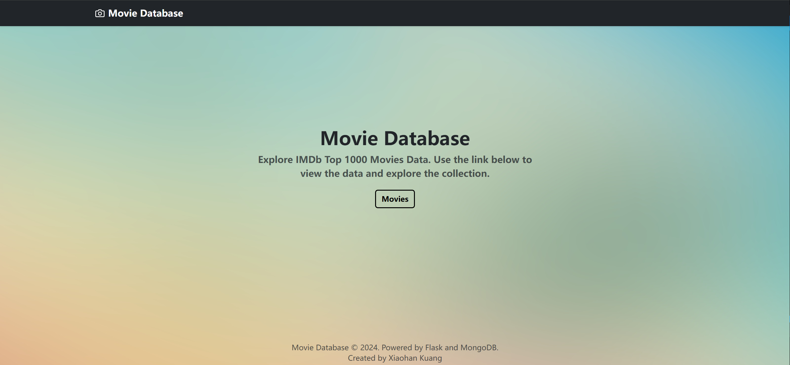
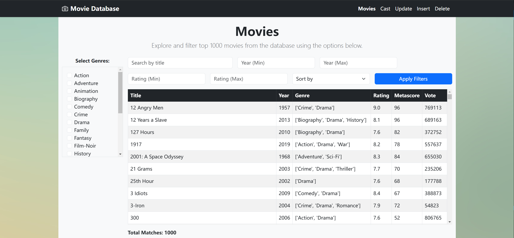
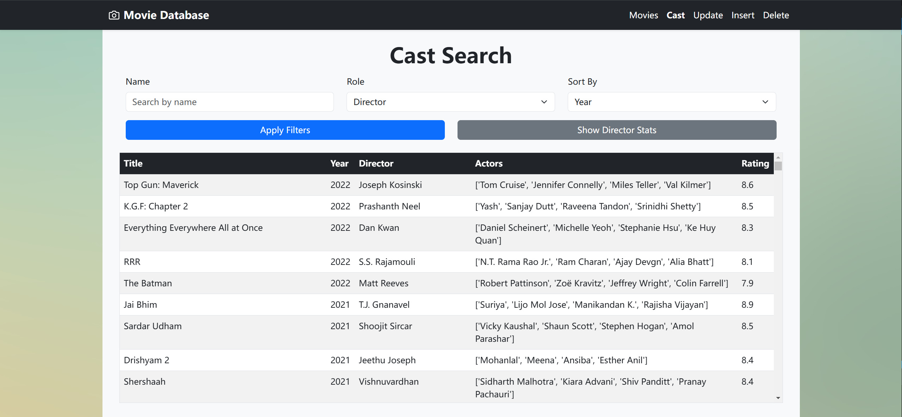
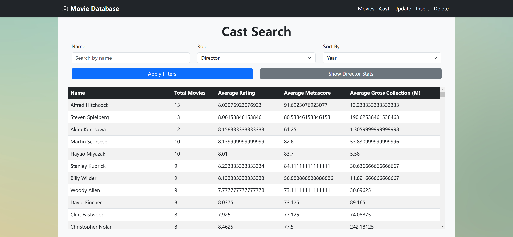
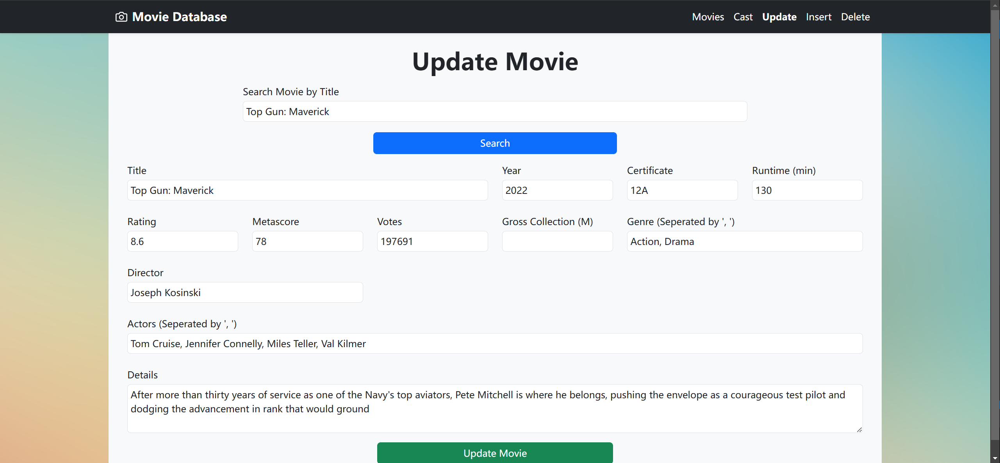
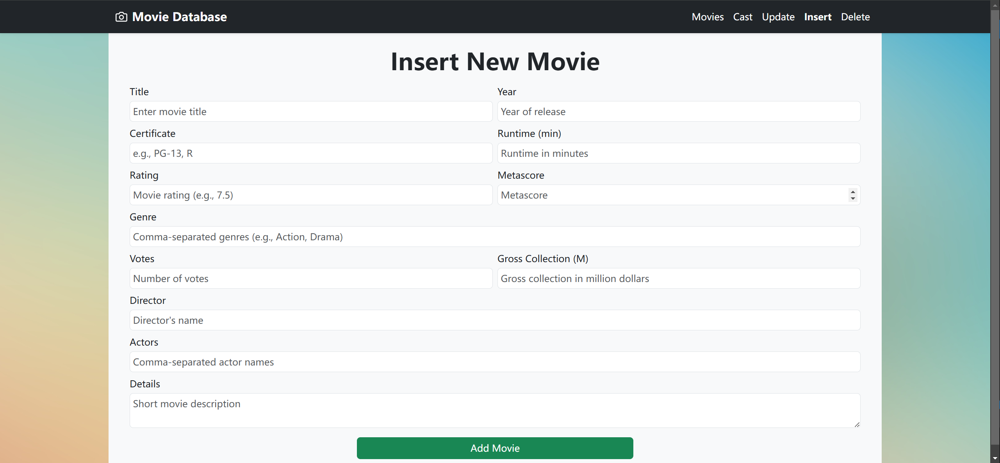
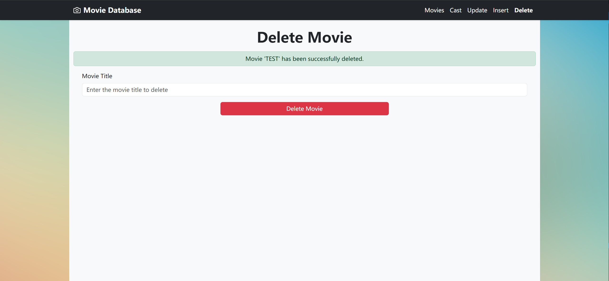

# IMDb Movie Database

This project uses IMDb's Top 1000 Movies dataset and integrates MongoDB with Flask to create a web-based user interface. Users can search, query, modify, insert, and delete movie data online.

## Features overview

- Search movies based on multiple filters such as genres, title, year, rating, and sorting options.
- View and analyze cast details, including roles and associated movies.
- Modify movie records, insert new movies, or delete existing ones.
- A user-friendly interface for database interaction.

## Dataset Source
The original data was obtained from [Kaggle](https://www.kaggle.com/datasets/ramjasmaurya/top-250s-in-imdb) and includes: 
- File: `imdb (1000 movies) in june 2022.csv`
- Stored in: `raw_data/` directory as the raw dataset.

## Setup
1. Environment
    - Use Docker Compose to set up the required environment:
        ```
        docker-compose up
        ```
    - Ensure the correct folder path for the local volume is updated in `docker-compose.yaml` before running the command.

2. Data Preparation

    Once the Docker containers are running:
    - Access the Python environment inside the container:
        ```
        docker exec -it slim-python bash
        ```
    - Run the following scripts:

        1. Convert CSV to JSON

            This script converts the raw dataset into a JSON format, saved in the `converted_data/` directory.
            ```
            python convert_csv_to_json.py
            ```
        2. Import Data into MongoDB:

            This script imports the converted JSON data into the MongoDB database.
            ```
            python import_data.py
            ```

        3. Start the Flask App:

            This launches the web app and it can be accessed by http://localhost:5000/
            ```
            python app.py
            ```

## Web UI and Features
1. Homepage

    Navigate to the database by clicking the "Movies" button.

    

2. Movie Overview

    **Filters**:
    - **Left Panel**: Multi-select genres to filter movies that satisfy all selected genres.
    - **Top Panel**: Search by title, specify minimum/maximum release year, define rating range, and sort results by various criteria.
    - **Bottom**: Display the total number of movies matching the selected filters.

    

3. Cast Search

    - Search by Name and Role:
        - Specify a name and role (Director/Actor) to display all movies involving the person.
        - Sort results by year, rating, metascore, or gross collection.

        


    - Director Statistics:

        Use the **"Show Director Stats"** button to display:
        - Total movies directed.
        - Average rating, metascore, and gross collection.

        

4. Update Movie Info

    1. **Search a Movie by Title:** Users can search for a movie in the database using its title.
    2. **Edit Fields:** If the movie exists, all fields such as title, year, certificate, runtime, genres, rating, metascore, votes, director, actors, and gross collection can be edited.
    3. **Save Changes:** Once edits are made, the updated data is saved to the MongoDB database.
    
    **Feedback:** The web application displays a success or failure message after updating the movie.

    

5. Insert New Movie

    Users can add new movies to the database.

    **Required Fields:**
    - **Title**: The name of the movie.
    - **Release Year**: The year the movie was released.
    - **Genre**: One or more genres (comma-separated).
    
    **Optional Fields:**
    - Certificate, runtime, rating, metascore, votes, director, actors, gross collection, and details.

    **Feedback:** The system will confirm whether the movie was successfully added to the database or if the insertion failed due to missing or invalid data.

    

6. Delete Movie

    Users can delete a movie from the database by specifying its exact title.

    **Features:**
    - A search field allows users to input the movie title they want to remove.
    - If the movie exists in the database, it will be permanently deleted.
    
    **Feedback:** After attempting to delete, the system provides a success message if the movie was found and deleted or a failure message if the movie does not exist.

    